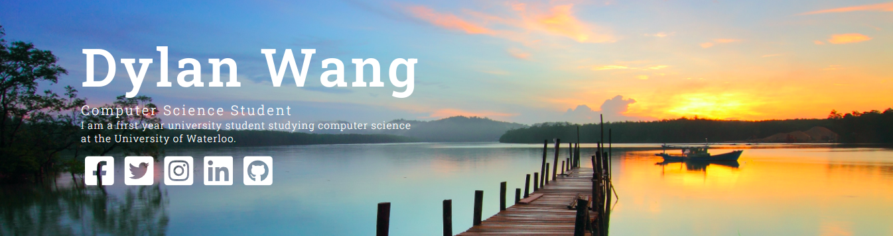

# Hello, I'm Dylan Wang! 👋
#### I am a fourth year Computer Science student at the University of Waterloo.

- 🌱 Algorithms
- 🎮 Data Structures
- 🍄 Web Development
- 💻 Machine Learning
- 🍏 Full Stack Development
- ⌛ Backend Engineering

## My Personal Wesbite
A personal website I created over the summer to display my skills and experiences.

## My Github Stats

## Contacts
- Email: dylan.s.wang@gmail.com
- LinkedIn: https://www.linkedin.com/in/dylanswang/

<!--
**dylanwang0/dylanwang0** is a ✨ _special_ ✨ repository because its `README.md` (this file) appears on your GitHub profile.

Here are some ideas to get you started:

- 🔭 I’m currently working on ...
- 🌱 I’m currently learning ...
- 👯 I’m looking to collaborate on ...
- 🤔 I’m looking for help with ...
- 💬 Ask me about ...
- 📫 How to reach me: ...
- 😄 Pronouns: ...
- ⚡ Fun fact: ...
-->
